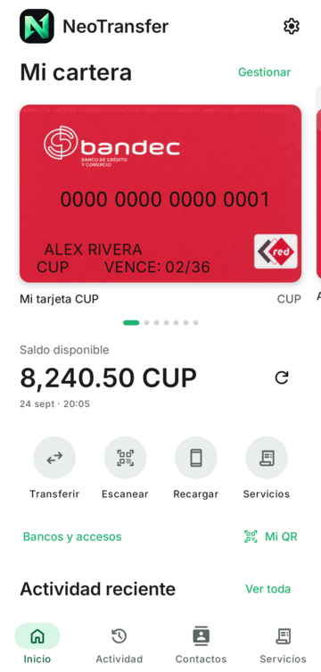
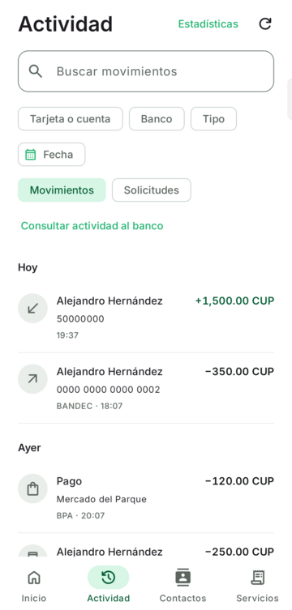
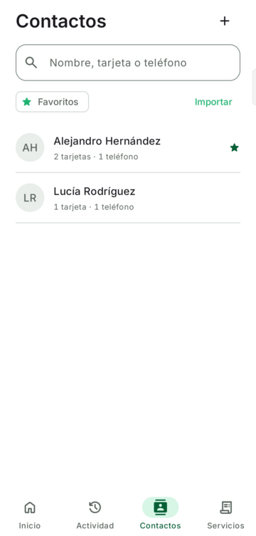

<p align="center">
  
</p>

# NeoTransfer

NeoTransfer es una aplicación Android independiente para gestionar tarjetas, consultas, transferencias, pagos y servicios en Cuba. No está afiliada a ETECSA, Transfermóvil ni a las entidades financieras. Cada operación depende de los servicios disponibles para la línea y del registro de su titular.

**Estado:** el repositorio tiene la [etiqueta v0.2.0](https://github.com/duardor968/NeoTransfer/tree/v0.2.0). Aún no hay publicaciones en GitHub Releases ni una versión pública 1.0.0. El trabajo hacia 1.0 está en este repositorio; el código en desarrollo no demuestra por sí solo que una operación haya sido aceptada por un banco o proveedor.

<p align="center">
  
  
  
</p>

Capturas del desarrollo 1.0 con datos ficticios. Los diseños de tarjetas siguen en revisión.

## Alcance

La base etiquetada v0.2.0 incluye acceso biométrico, consulta de saldo, formularios de transferencia y servicios, lectura QR e historial para BPA y BANDEC. La consulta de saldo se probó con una cuenta real; esa prueba no certifica las demás operaciones.

La línea de desarrollo amplía la cartera a BPA, BANDEC, BANMET, MiTransfer y Clásica personal; incorpora contactos, cámara, consultas y pagos, MiTurno, cupones de combustible y respaldo cifrado. Cada operación tiene sus propios campos, validaciones y límites de evidencia. Consulta el [resumen de cobertura](docs/cobertura.md) y el [protocolo](docs/protocolo.md) para conocer el alcance de cada contrato.

Quedan fuera de esta etapa BFI, Bulevar, Clásica Empresarial, el perfil agente de MiTransfer, MiBoleto, las reservas OFA 8 y 9 y Votomóvil 215. El aporte OFA 94 y las operaciones personales restantes están dentro del alcance de desarrollo, sujetos a contratos y validación por operación.

## Requisitos

- Android 15 o posterior y telefonía celular para operaciones USSD.
- Biometría fuerte configurada para proteger los accesos bancarios.
- Línea, registro y permisos compatibles con cada servicio. La cámara es opcional para las funciones que la usan.

## Primeros pasos

Cuando exista una versión publicada, descarga su APK desde [GitHub Releases](https://github.com/duardor968/NeoTransfer/releases) e instálalo en un teléfono compatible. Por ahora, la línea 1.0 sigue en desarrollo.

1. Abre NeoTransfer, elige el banco o proveedor y la línea telefónica registrada. Guarda el acceso con tu clave y huella. Si aún no tienes registro, usa «Crear registro» para ese proveedor.
2. En «Mi cartera», toca «Añadir tarjeta o cuenta», elige el acceso y guarda el producto con su nombre y moneda.
3. Selecciona el producto de origen antes de consultar, pagar o transferir. Revisa los datos y el resultado de cada operación en la aplicación.

## Desarrollo

El proyecto usa Kotlin y Jetpack Compose, con `core` para contratos y lógica y `app` para Android. Requiere JDK 21 y Android SDK 36. Las variantes `debug` y `preview` usan identificadores distintos del paquete principal; `preview` usa datos sintéticos. La firma de producción es local y no se necesita para estas variantes.

```powershell
.\gradlew.bat :core:test :app:testDebugUnitTest :app:assembleDebug :app:assemblePreview :app:assembleDebugAndroidTest :app:lintDebug
```

Este comando compila las pruebas instrumentadas, pero no las ejecuta en un dispositivo. [Desarrollo y pruebas](docs/desarrollo.md) explica cómo comprobarlas y qué evidencia falta antes de publicar. [Arquitectura](docs/arquitectura.md) describe las fronteras principales del código. [Protocolo](docs/protocolo.md) distingue los contratos extraídos de resultados bancarios comprobados.

Consulta los [resultados de verificación](docs/verificacion.md) para distinguir las pruebas locales, las realizadas en el teléfono y la aceptación bancaria pendiente.

## Licencia

El código se distribuye bajo [Apache 2.0](LICENSE). Las dependencias, fuentes y recursos de terceros conservan sus licencias y marcas respectivas.

Los cuatro fondos de tarjetas (`card_bpa_red`, `card_bandec_red`, `card_banmet_red` y `card_clasica_personal`) son reconstrucciones gráficas generadas a partir de referencias, no archivos oficiales de las entidades. Sus marcas identifican los productos representados. Los fondos no contienen números, nombres ni vencimientos personales: la aplicación dibuja esos datos por separado. Su fidelidad visual sigue en revisión.
